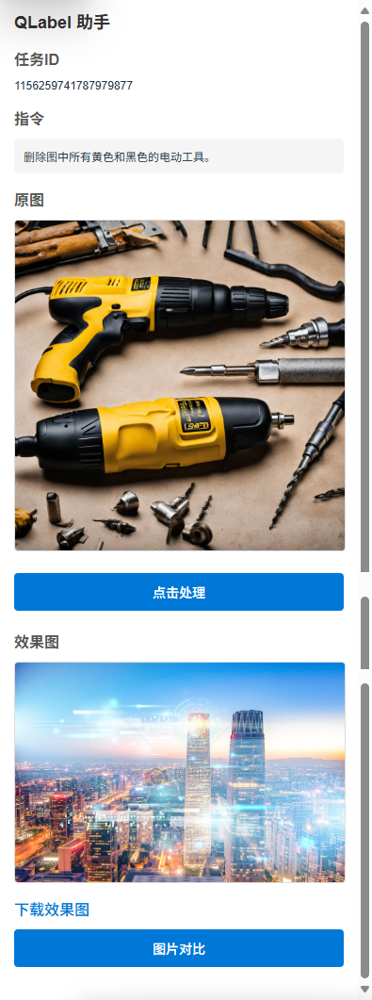
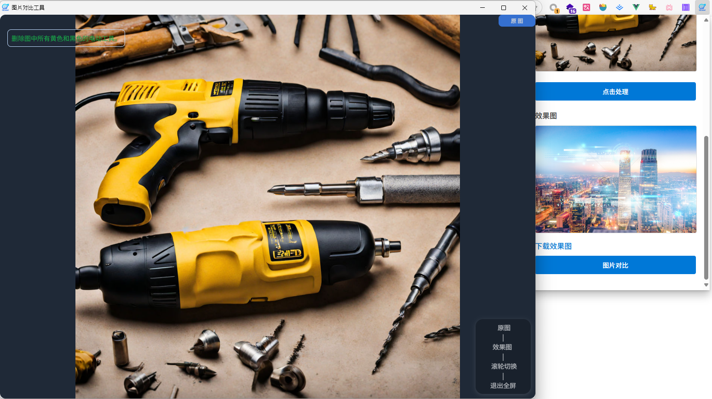

# QLabel Extension

一个用于辅助图像标注的浏览器扩展程序。

## 功能特性

- 自动获取QLabel平台的标注任务的图片和指令
- 展示任务指令和原始图像
- 使用自定义服务处理图像标注
- 结果预览和下载
- 图片对比功能

## 使用方法

1. 安装扩展程序
2. 打开QLabel平台
3. 点击扩展图标即可使用

## 界面预览

## 安装说明

### Chrome/Edge浏览器

1. 下载或克隆本项目
2. 打开浏览器扩展管理页面 (chrome://extensions/)
3. 开启"开发者模式"
4. 点击"加载已解压的扩展程序"
5. 选择本项目目录

### Firefox浏览器

1. 下载或克隆本项目
2. 打开Firefox扩展管理页面 (about:addons)
3. 点击齿轮图标，选择"调试附加组件"
4. 点击"临时载入附加组件"
5. 选择本项目的manifest.json文件

## 权限说明

- `activeTab`: 访问当前活动标签页，用于获取任务信息
- `storage`: 存储用户设置和缓存数据
- `scripting`: 注入内容脚本以获取页面数据

## 开发
本项目初始化代码使用AI生成（[原始AI Prompt](../material/qlabel-files/README.md) - [AI 结果](../material/qlabel-files/ai.md)），后续功能开发和调试均手动修改。

使用WXT框架开发，详细介绍请查看[WXT框架文档](https://github.com/wxt-dev/wxt)。

[浏览器扩展开发框架-WXT](../use-WXT.md)