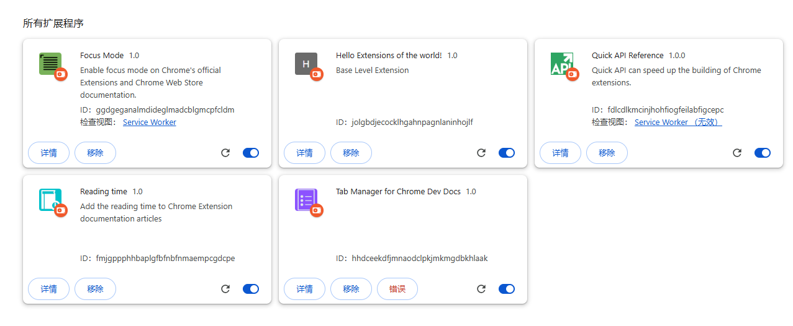

# hello-browser-extensions

## 浏览器扩展开发入门

+ [hello-world](./01-hello-world)：Hello World extension
+ [reading-time](./02-reading-time)：Reading Time Extension
+ [focus-mode](./03-focus-mode)：Focus Mode Extension
+ [quick-api-reference](04-quick-api-reference)：Google Dev Quick API Reference
+ [tabs-manager](./05-tabs-manager)：Tabs Group Manager



## 浏览器扩展开发框架-WXT

[WXT](https://github.com/wxt-dev/wxt) 是一个用于开发浏览器扩展的框架，支持 Chrome、Edge、Firefox 和 Safari 浏览器。它简化了扩展的开发过程，提供了统一的 API 和工具，使开发者能够更轻松地创建跨浏览器的扩展。

+ [wxt-vue](./06-wxt-vue)：WXT + Vue 3 demo
+ [wxt-react](./07-wxt-react)：WXT + React demo

> [使用WXT开发浏览器扩展](./use-WXT.md)

## 浏览器扩展开发框架-Plasmo

[Plasmo](https://docs.plasmo.com/) 是一个现代化的浏览器扩展开发平台，专为简化扩展开发流程而设计。它支持所有主流浏览器（Chrome、Firefox、Edge、Safari），并提供了丰富的工具和功能来加速扩展开发。

+ [plasmo-all](./09-plasmo-all)：Plasmo All 功能演示

> [使用Plasmo开发浏览器扩展](./use-Plasmo.md)

## 各示例详细说明

以下是对各个示例的详细介绍，每个链接指向对应示例目录下的 README 文件：

### 基础示例

1. [Hello World Extension](./01-hello-world/README.md) - 最简单的浏览器扩展示例，展示基本结构
2. [Reading Time Extension](./02-reading-time/README.md) - 为网页添加阅读时间统计功能
3. [Focus Mode Extension](./03-focus-mode/README.md) - 为网页添加专注模式功能，隐藏干扰元素
4. [Quick API Reference](./04-quick-api-reference/README.md) - 使用 service worker 处理后台任务和 omnibox API
5. [Tabs Manager](./05-tabs-manager/README.md) - 标签页分组和管理功能

### WXT 框架示例

1. [WXT + Vue](./06-wxt-vue/README.md) - 使用 WXT 框架和 Vue 3 开发的扩展
2. [WXT + React](./07-wxt-react/README.md) - 使用 WXT 框架和 React 开发的扩展

### Plasmo 框架示例

1. [Plasmo All](./09-plasmo-all/README.md) - 使用 Plasmo 框架开发的全功能扩展示例


### 应用案例
1. [QLabel Extension](./08-qlabel-extension/README.md) - 一个用于辅助图像对比的浏览器扩展程序。
2. [小红书图片下载器](./10-xhs-download/README.md) - 一个用于小红书网站的浏览器扩展，可以方便地下载帖子中的图片，支持去水印功能。

### 深入指南
1. [更进一步](./guide.md)

## Submodule管理说明

### 小红书图片下载器（10-xhs-download）

`10-xhs-download`目录使用Git Submodule方式管理，指向独立的GitHub仓库：https://github.com/Keekuun/xhs-download.git

### 克隆包含Submodule的仓库

```bash
# 克隆主仓库
git clone https://github.com/your-username/hello-browser-extensions.git

# 初始化并更新所有Submodule
git submodule update --init --recursive
```

### 更新Submodule

```bash
# 进入Submodule目录
cd 10-xhs-download

# 拉取最新代码
git pull origin main

# 返回主仓库并提交Submodule引用更新
cd ..
git add 10-xhs-download
git commit -m "Update 10-xhs-download submodule"
```

### 在Submodule中进行开发

```bash
# 进入Submodule目录
cd 10-xhs-download

# 进行正常的Git操作
# 例如：修改文件、提交更改、推送到远程仓库
git add .
git commit -m "Update feature"
git push origin main

# 返回主仓库并提交Submodule引用更新
cd ..
git add 10-xhs-download
git commit -m "Update 10-xhs-download submodule"
```

### 查看Submodule状态

```bash
# 查看Submodule状态
git submodule status

# 查看详细信息
git submodule status --recursive
```

### 关于Submodule的更多信息

详细的Git Submodule使用方法和操作指南，请参考：[Git Submodule 和 Subtree 使用指南](./GIT_SUBMODULE_SUBTREE_GUIDE.md)